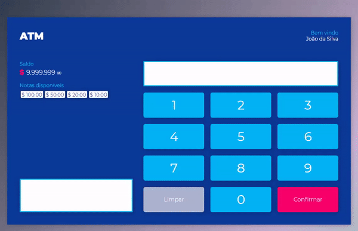

# ATM MACHINE 

> *I made this project as a challenge of JavaScript module of FrontEnd from [HEROWAY] course,*
> *built with JavaScript, HTML5 and CSS3.*

# Objectives:

 - Implement knowledge learned.
 
 - **Simullate a cash machine:**
 - Calculate money bills, the system must give the smallest amount of banknotes;
 - Don't allow withdraw values below $10 (because the smaller banknote we have is $10);
  
# Tech:

* [Visual Studio Code] - Code editor 
* [Live Server] -  Local server with live reload 
* [EditorConfig] - File format

[HEROWAY]: <https://www.heroway.com.br/treinamento/>
[Visual Studio Code]: <https://code.visualstudio.com/>
[Live Server]: <https://marketplace.visualstudio.com/items?itemName=ritwickdey.LiveServer>
[EditorConfig]: <https://editorconfig.org/>
